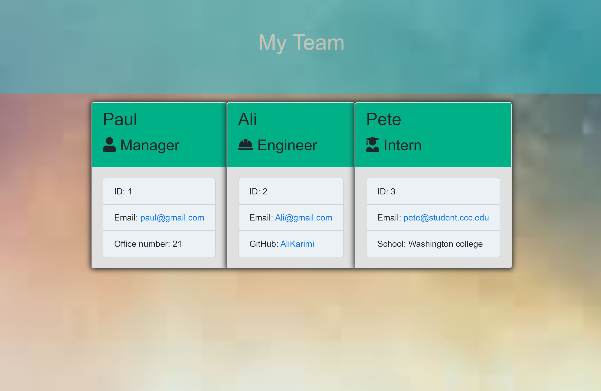

# Employee-Summary Generator

As a manager
I want to generate a webpage that displays my team's basic info
so that I have quick access to emails and GitHub profiles

[Link to Video]()

---
## Table of Content
* [Description](#Description)

* [Installation](#Installation)

* [Usage](#Usage)

* [Test](#Test)

* [License](#License)

* [Question](#Question)

## Description
The application will prompt the user for information about the team manager and then information about the team members. The user can input any number of team members, and they may be a mix of engineers and interns. When the user has completed building the team, the application will create an HTML file that displays a nicely formatted team roster based on the information provided by the user.
   
---
## Installation:
After downloading the project, use `npm install` in your terminal to install 'inquirer' and 'jest' and make sure you have 'packag-lock.json' and 'node_module' in your project folder.
   
---
## Usage:
This application is a Node CLI that takes in information about employees and generates an HTML webpage that displays summaries for each person.
  
---
## Test:
For testing this application, we used "jest" which is a Javascript testing framework. ALL TESTS HAS BEEN PASSED!
  
--- 
## Question?
If you have any question or require any further information, feel free to contact me. 

GitHub: https://github.com/karimi65

Email: ali216k@gmail.com
